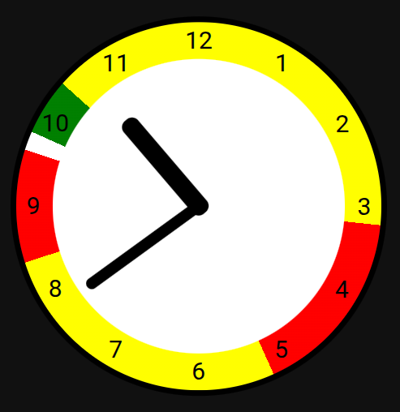

[](https://github.com/hacs/integration)
[](https://buymeacoffee.com/klurige)

# Level Indicator Clock
This card shows an analogue clock that presents current time and electricity price level for the next twelve hours.

It is tightly coupled with the **[electricitypricelevels](https://github.com/Klurige/electricitypricelevels)** integration.



The outer circle shows red for high, yellow for medium and green for low electricity price levels.

There is also a white delimiter marking the breakpoint between the past and the future.

## Dependencies
This card uses the output from the **[electricitypricelevels](https://github.com/Klurige/electricitypricelevels)** integration.

Install that integration, including its dependencies, first.

## Development
### Setup
Follow these tutorials to setup your environment: 
  * Setup a devcontainer: https://github.com/home-assistant-tutorials/01.development-environment
  * Install HACS: https://github.com/home-assistant-tutorials/07.toggle-card-to-hacs

Once you've got your devcontainer running, you should install the dependencies as above.

Clone this repository: git clone https://github.com/Klurige/levelindicatorclock.git

Modify the `.devcontainers/devcontainer.json` file and include a mount :
```
{
"name": "Home Assistant Dev",
"mounts": [
"source=<PATH/TO/GIT/levelindicatorclock/dist,target=/workspaces/home-assistant-core/config/www/levelindicatorclock,type=bind,consistency=cached"
],
...
```
Rebuild the devcontainer and restart it.

You can now add the card to a dashboard as usual.

### Development
To start the development server, run the following command in the terminal:
```bash
npx parcel src/index.ts
```
This will rebuild the card whenever you make changes to the source code.

To update the card in the browser, you will need to hard-refresh the browser.
For Google Chrome: Open the Inspect window and press: `Ctrl+Shift+R`.
Other browsers may have different shortcuts.